## Introducción

Comparativo con otros sistemas:

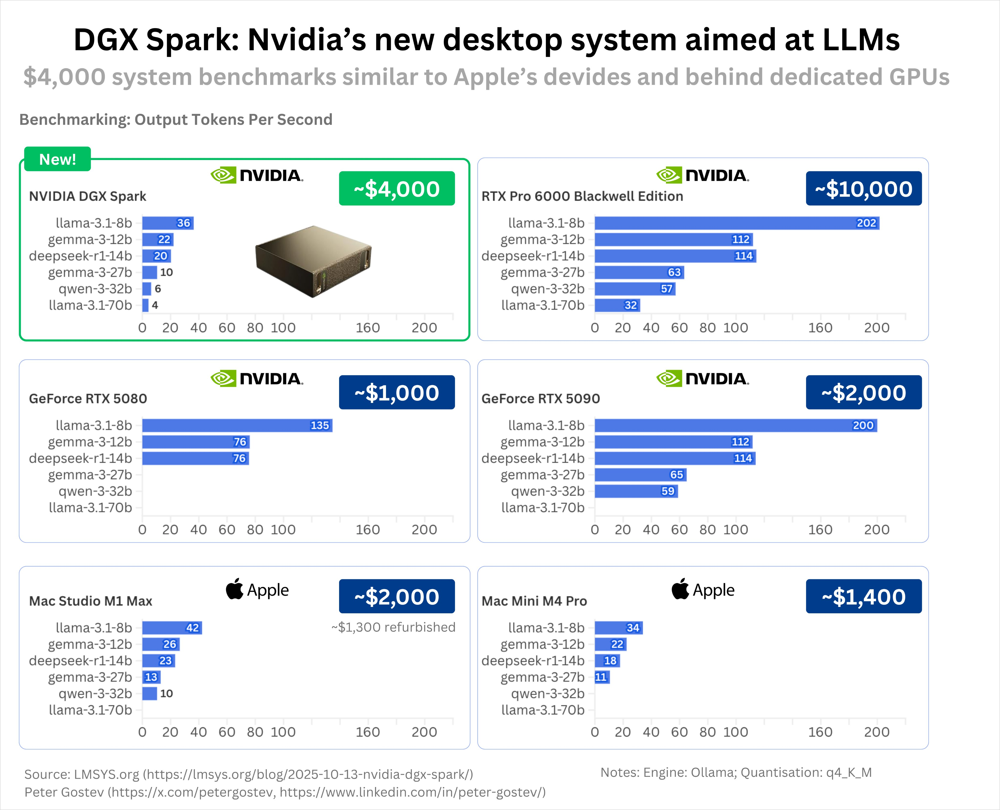

## Compatibilidad CUDA

CUDA es el software específico de Nvidia para ejecutar aplicaciones en GPU.

Nvidia utiliza una número de versión X.y llamado *compute capability* para agrupar las GPUs que tienen la misma arquitectura, juego de instrucciones y tipos de datos.

Las tablas de correspondencia entre el *compute capability* y versión de CUDA están en el artículo [CUDA de la Wikipedia](https://en.wikipedia.org/wiki/CUDA).

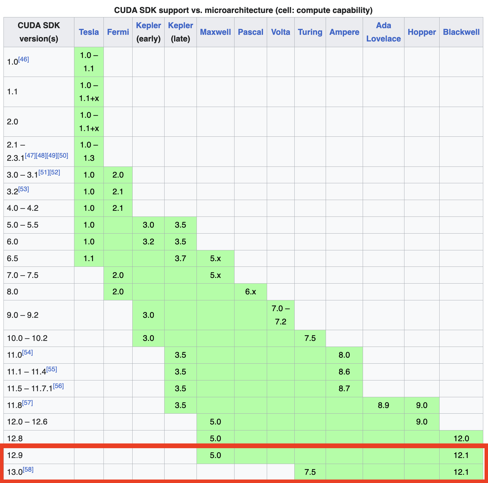

La GPU GB10 del DGX Spark tiene *compute capability* 12.1, que empieza a estar soportado por CUDA a partir de la versión 12.9.

## La pila de software de Nvidia

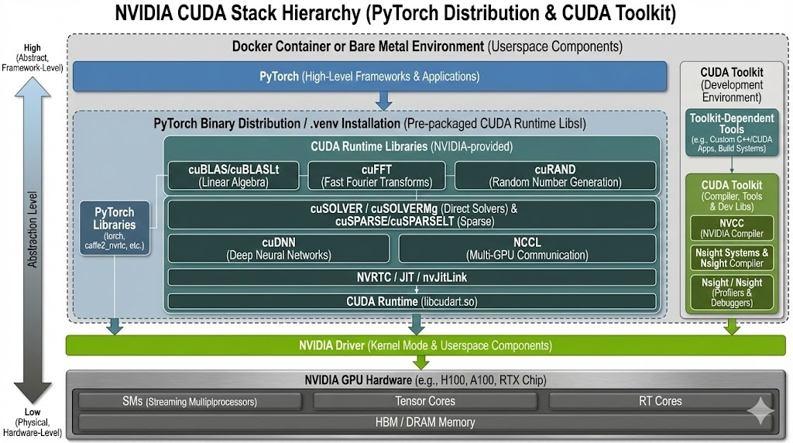

PyTorch incluye el *runtime* de CUDA dentro de sus paquetes precompilados, y normalmente cada versión de PyTorch se publica en múltiples variantes para distintas versiones de CUDA: hay que elegir una variante con **CUDA ≥ 12.9** para que funcione en el Spark.

Las aplicaciones PyTorch o CUDA se pueden ejecutar en máquina física o docker. En caso de optar por docker, todos los componentes de la pila CUDA pueden ir dockerizados sin problemas, excepto el driver de Nvidia, que **debe estar instalado en el anfitrión**.

## Requisitos previos

### uv

Recomiendo usar `uv` para gestionar los entornos virtuales de Python. Tiene toda la funcionalidad de `pip`, `venv` y `pyenv` pero es mucho más rápido: con la caché precalentada, los tiempos de instalación son **instantáneos**:

Para instalarlo, ejecutamos:

```sh
curl -LsSf https://astral.sh/uv/install.sh | sh
```

Después, salimos y volvemos a entrar al shell para que se haga efectivo el cambio en el PATH.

> ⚡💡 Si el proyecto declara las dependencias en `pyproject.toml` ni siquiera es necesario crear el entorno virtual: `uv run script.py` lo crea al vuelo y, después, ejecuta el script.

### nvtop

`nvtop` es una herramienta para monitorizar el uso de la GPU. Para instalarlo, ejecutamos:

```sh
sudo apt install nvtop
```

### PyTorch

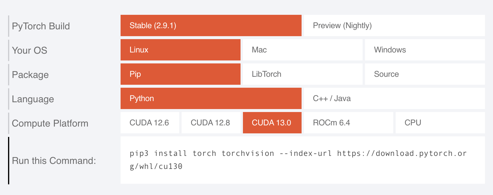

Actualmente (enero de 2026) las siguientes versiones de PyTorch ofrecen paquetes precompilados contra versiones de CUDA >= 12.9.

- PyTorch 2.9.1 + CUDA 13.0
- PyTorch 2.8 + CUDA 12.9

Las versiones anteriores de PyTorch están compiladas contra versiones CUDA inferiores a 12.9 y, por tanto, **no funcionarán en el Spark**.

En los proyectos que usan `pyproject.toml` (lo recomendado), podemos instalar la versión adecuada de PyTorch para el Spark con:

```toml
dependencies = [
    "torch>=2.9.1",
]

[[tool.uv.index]]
name = "pytorch-cu130"
url = "https://download.pytorch.org/whl/cu130"
explicit = true

[tool.uv.sources]
torch = { index = "pytorch-cu130" }
```

Si no tenemos `pyproject.toml`, podemos instalar torch en un entorno virtual con:

```sh
uv pip install torch torchvision --index-url https://download.pytorch.org/whl/cu130
```

Para comprobar si PyTorch está instalado correctamente con el notebook de Marimo [000_test_torch.py](000_test_torch.py):

```sh
uv run marimo edit 000_test_torch.py --host 192.168.4.127
```

### ComfyUI

```sh
cd ~/git
git clone https://github.com/Comfy-Org/ComfyUI.git
cd ComfyUI
```

Creamos el entorno virtual e instalamos dependencias. Actualmente la máxima versión de Python soportada por el mayor número de paquetes es la 3.12.

```sh
uv venv -p 3.12
uv pip install torch torchvision torchaudio --index-url https://download.pytorch.org/whl/cu130
uv pip install -r requirements.txt
```

### ComfyUI Manager

ComfyUI tiene un gestor de *custom nodes* que permite descargarlos automáticamente cuando faltan sin tener que hacerlo desde el terminal:

```sh
git clone https://github.com/ltdrdata/ComfyUI-Manager custom_nodes/comfyui-manager
```

Ejecutamos ComfyUI:

```sh
uv run main.py --listen 0.0.0.0
```

Para acceder a ComfyUI desde el navegador apuntamos a http://192.168.4.127:8188/.

## Ejemplos ComfyUI

### Qwen Image Edit 2511

Usaremos como base el workflow de este [tutorial](https://www.nextdiffusion.ai/tutorials/consistent-outfit-changes-with-multi-qwen-image-edit-2511-in-comfyui).

En el directorio [demo/comfy](demo/comfy) tenemos dos imágenes de ejemplo que llevan el workflow embebido en el propio PNG.

Para reproducirlos, arrastramos el PNG a ComfyUI:

- [qwen_edit_2511_kia.png](img/qwen_edit_2511_kia.png)
- [qwen_edit_2511_vestido.png](img/qwen_edit_2511_vestido.png)

El cargar el workflow nos encontaremos con la advertencia de que faltan nodos.

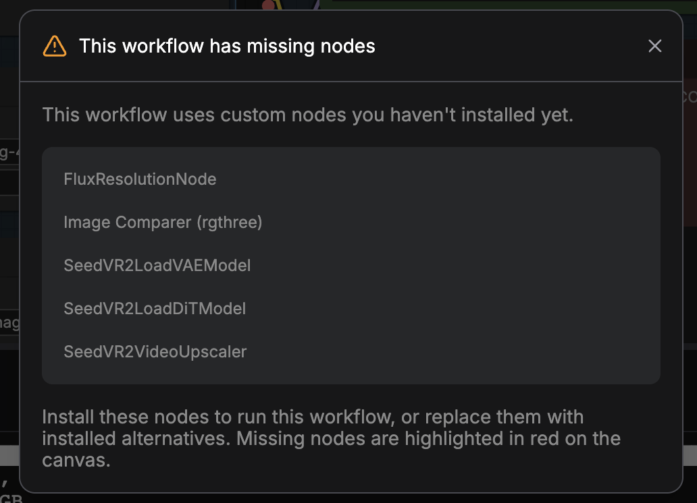

Para instalar los nodos faltantes, vamos al manager y le damos al botón de instalar los nodos que faltan.

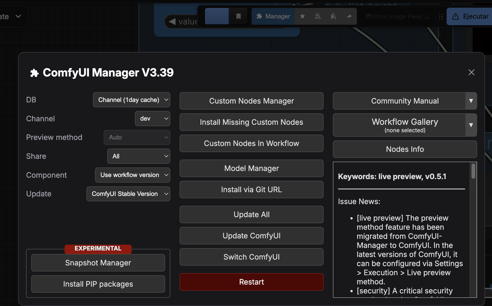

Tras instalar los nodos faltantes, deberemos reiniciar:

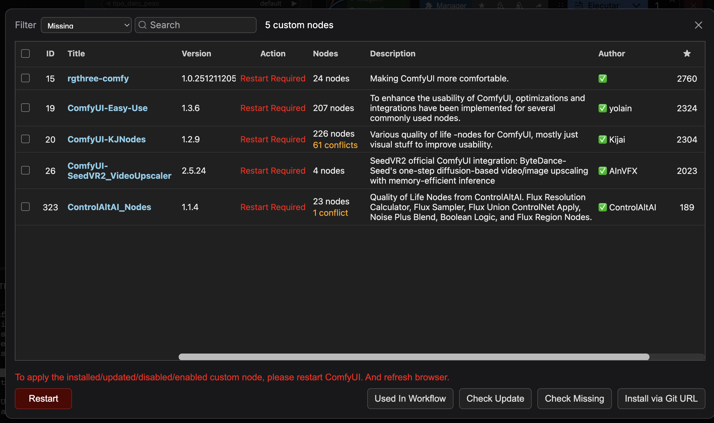

También nos avisará de que faltan modelos.

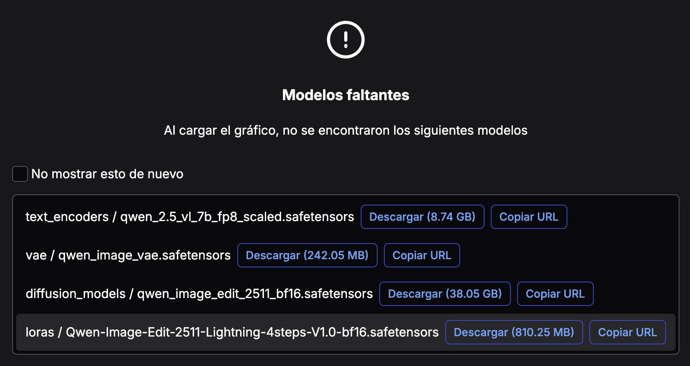

Pero si le damos al botón de descarga de cada modelo veremos que los intentará descargar en local.

En su lugar, vamos a copiar cada URL con el botón `Copiar URL` y los descargaremos en su sitio manualmente.

Los modelos en ComfyUI están en el directorio `models/TIPO`, donde TIPO puede ser `text_encoders`, `vae`, `diffusion_models`, `loras`, etc.

Esta es la lista de comandos `wget` necesaria para descargar todos los modelos de este workflow:

```sh
wget -P models/diffusion_models https://huggingface.co/Comfy-Org/Qwen-Image-Edit_ComfyUI/resolve/main/split_files/diffusion_models/qwen_image_edit_2511_bf16.safetensors
wget -P models/vae https://huggingface.co/Comfy-Org/Qwen-Image_ComfyUI/resolve/main/split_files/vae/qwen_image_vae.safetensors
wget -P models/text_encoders https://huggingface.co/Comfy-Org/Qwen-Image_ComfyUI/resolve/main/split_files/text_encoders/qwen_2.5_vl_7b_fp8_scaled.safetensors
wget -P models/loras https://huggingface.co/lightx2v/Qwen-Image-Edit-2511-Lightning/resolve/main/Qwen-Image-Edit-2511-Lightning-4steps-V1.0-bf16.safetensors
```

Para editar una imagen la subimos al nodo correspondiente. Podemos incluir hasta 2 imágenes más de referencia. En el prompt positivo escribimos el prompt de edición. En el negativo (opcional) podemos escribir aspectos a evitar (malformaciones, mala calidad, etc.).

Tarda ~5-6m la primera generación a 1.0Mpx de área, ~2m las sucesivas.

Como ejercicio:

- Probar a desconectar con CTRL-B el lora de 4 steps. Habrá que subir el CFG. Mejorará la calidad ligeramente a costa de aumentar el tiempo de generación.
- Probar [Qwen Image 2512](https://qwen.ai/blog?id=qwen-image-2512), actualmente el modelo open-source más avanzado de generación de imagen según [AI Arena](https://aiarena.alibaba-inc.com/corpora/arena/leaderboard?spm=a2ty_o06.30285417.0.0.6740c921UrbI1O&arenaType=T2I).

### Flux.2 Klein 9B

Los modelos FLUX.2 están disponibles en Hugging Face pero es necesario aceptar los términos de uso desde sus respectivos repositorios, para lo cual necesitaremos una cuenta en Hugging Face y autenticarnos con:

```sh
uv tool install huggingface-hub
hf auth login
```

Para posteriormente descargar los modelos:

```sh
hf download black-forest-labs/FLUX.2-klein-9b-fp8 flux-2-klein-9b-fp8.safetensors --repo-type model --local-dir models/diffusion_models
hf download black-forest-labs/FLUX.2-klein-9b-nvfp4 flux-2-klein-9b-nvfp4.safetensors --repo-type model --local-dir models/diffusion_models
wget -P models/text_encoders https://huggingface.co/Comfy-Org/flux2-klein-9B/resolve/main/split_files/text_encoders/qwen_3_8b_fp8mixed.safetensors
wget -P models/vae https://huggingface.co/Comfy-Org/flux2-dev/resolve/main/split_files/vae/flux2-vae.safetensors
```

Podemos probar el workflow con estos 2 ejemplos:

- [flux_2_klein_9b_fp8.png](img/flux_2_klein_9b_fp8.png)
- [flux_2_klein_9b_nvfp4.png](img/flux_2_klein_9b_nvfp4.png)

FLUX.2 Klein 9B es MUCHO más rápido que Qwen Edit 2511:

- ~150s la primera ejecución (por la carga de modelos)
- ~20s las sucesivas

### Z-Image

Z-Image es un modelo de Alibaba sorprendentemente rápido y de calidad similar a otros modelos abiertos como FLUX.1. Destaca en el fotorrealismo.

Usaremos la plantilla "Texto a imagen (Nuevo)" de ComfyUI, la podemos encontrar filtrando por modelo `Z-Image Turbo`.

Comandos wget listos para descargar los modelos en su sitio:

```sh
wget -P models/text_encoders https://huggingface.co/Comfy-Org/z_image_turbo/resolve/main/split_files/text_encoders/qwen_3_4b.safetensors
wget -P models/vae https://huggingface.co/Comfy-Org/z_image_turbo/resolve/main/split_files/vae/ae.safetensors
wget -P models/diffusion_models https://huggingface.co/Comfy-Org/z_image_turbo/resolve/main/split_files/diffusion_models/z_image_turbo_bf16.safetensors
```

Worflow the ejemplo:

- [z_image_turbo.png](img/zimage_split_woman.png)

Este modelo también es muy rápido: tarda ~70s la primera ejecución, ~15s las sucesivas.

### Wan 2.2 Animate

Seguiremos este [tutorial](https://www.nextdiffusion.ai/tutorials/how-to-use-wan-2-2-animate-in-comfyui-for-character-animations).

Los modelos a descargar son:

```sh
wget -P models/diffusion_models https://huggingface.co/Kijai/WanVideo_comfy_fp8_scaled/resolve/main/Wan22Animate/Wan2_2-Animate-14B_fp8_e4m3fn_scaled_KJ.safetensors
wget -P models/vae https://huggingface.co/Kijai/WanVideo_comfy/resolve/main/Wan2_1_VAE_bf16.safetensors
wget -P models/clip_vision https://huggingface.co/Comfy-Org/Wan_2.1_ComfyUI_repackaged/resolve/main/split_files/clip_vision/clip_vision_h.safetensors
wget -P models/text_encoders https://huggingface.co/Kijai/WanVideo_comfy/resolve/main/umt5-xxl-enc-bf16.safetensors
wget -P models/loras https://huggingface.co/Kijai/WanVideo_comfy/resolve/main/Lightx2v/lightx2v_I2V_14B_480p_cfg_step_distill_rank64_bf16.safetensors
wget -P models/loras https://huggingface.co/Comfy-Org/Wan_2.2_ComfyUI_Repackaged/resolve/main/split_files/loras/wan2.2_animate_14B_relight_lora_bf16.safetensors
wget -P models/detection https://huggingface.co/Wan-AI/Wan2.2-Animate-14B/resolve/main/process_checkpoint/det/yolov10m.onnx
wget -P models/detection https://huggingface.co/JunkyByte/easy_ViTPose/resolve/main/onnx/wholebody/vitpose-l-wholebody.onnx
```

Desde el manager, instalar los nodos que faltan:

- La mayoría de nodos están en el canal `default`.
- Los que falten hay que descargarlos del canal `dev`.

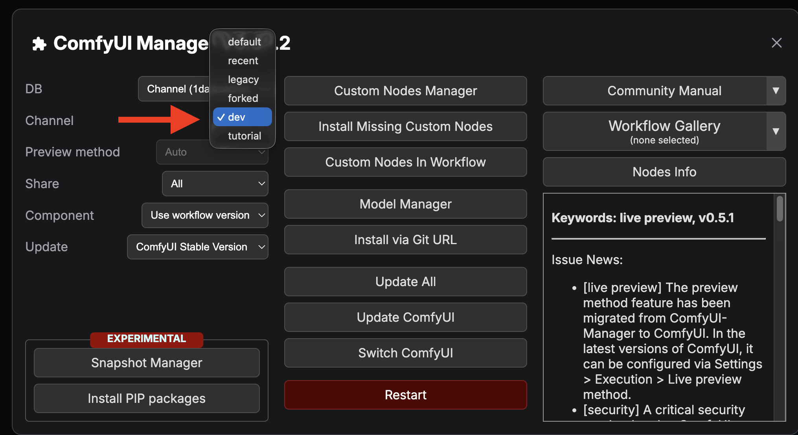

En este workflow:

- Elegimos la resolución de salida
- En el nodo Cargar imagen subimos la imagen con el personaje a animar.
- En el nodo Vídeo Upload subimos el vídeo con la acción a animar.
- En el nodo WanVideo Model Loader -> attention mode -> sdpa. Por defecto usa sage attention, que se podría instalar para ganar algo de velocidad pero instalar sage attention no es fácil.
- Desactivamos (CTRL+B) el nodo WanVideo Torch Compile Settings. También aporta velocidad pero el pre-calentamiento es lento, y necesita `gcc`.

Tarda 12m aprox para vídeo de 4s, 8m en generaciones sucesivas (para el mismo vídeo).

## MiniMax-M2.1

[Hay quien dice](https://x.com/akshay_pachaar/status/2003808497339924706) que este modelo es "Claude pero al 10% de su precio". Probémoslo.

Descargamos el modelo:

```sh
uv tool install huggingface-hub
mkdir ~/models
cd ~/models
hf download AaryanK/MiniMax-M2.1-GGUF MiniMax-M2.1.q2_k.gguf --local-dir ./minimax-m21-gguf
```

Instalamos llama.cpp ([fuente](https://forums.developer.nvidia.com/t/tutorial-build-llama-cpp-from-source-and-run-qwen3-235b/352604/12)):

```sh
cd ~/git
git clone https://github.com/ggml-org/llama.cpp.git
cd llama.cpp
cmake -B build -DGGML_CUDA=ON -DLLAMA_CURL=OFF
cmake --build build --config Release -j 20
cd build/bin
```

Para ejecutar y hablar con el modelo desde el terminal:

```sh
./llama-cli -m ~/models/MiniMax-M2.1.q2_k.gguf -c 8192 --temp 1.0 --top-p 0.95 --top-k 40 -p "Hello"
```

En http://192.168.4.127:8080/ se nos abrirá un interfaz web para hablar con el modelo, tipo ChatGPT.

También podemos integrarlo en algún IDE. En Cursor es difícil porque las llamadas a las API de los modelos las hacen desde su backend y habría que poner el servicio en una IP pública. Pero podemos usar Opencode o Zed, que sí soportan llamadas en red local a APIs tipo OpenAI como la que ofrece llama.cpp.

Con `-c` podemos indicar la longitud del contexto máxima en tokens. MiniMax-M2.1 fue entrenado con ~190K tokens.

```sh
./llama-server \
  -m ~/models/minimax-m21-gguf/MiniMax-M2.1.q2_k.gguf \
  -c 32768 \
  --host 0.0.0.0 --port 8080 \
  --jinja
```

En Zed, debemos añadir esto al `settings.json`:

```json
  "language_models": {
    "openai_compatible": {
      "LLAMA_CPP": {
        "api_url": "http://192.168.4.127:8080/v1",
        "available_models": [
          {
            "name": "minimax",
            "display_name": "MiniMax M2.1 (llama.cpp local)",
            "max_tokens": 8192,
            "capabilities": {
              "tools": true,
              "images": false,
              "parallel_tool_calls": false,
              "prompt_cache_key": false,
            },
          },
        ],
      },
    },
  }
```

E introducir una clave de API cualquiera en la configuración de agentes IA de Zed:

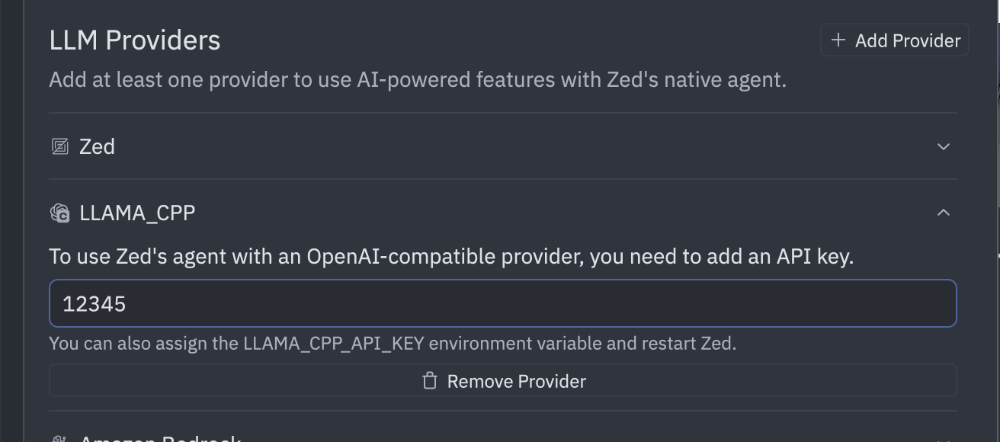

En [demo/space_invaders] hay una demo generada con MiniMax-M2.1 con el prompt:

```txt
Can you code a minimal but working space invaders game in @space_invaders.html in modern html + js + css?
```

Podemos servirla desde http://192.168.4.127:8888/ con:

```sh
uv run -m http.server --directory demo/space_invaders 8888
```

## Entrenamiento con AI Toolkit de Ostris

```sh
cd ~/git
git clone https://github.com/ostris/ai-toolkit.git
cd ai-toolkit
uv init -p 3.12
```

En pyproject.toml añadimos a mano la dependencia de PyTorch 2.9.1 + CUDA 13.0:

```toml
dependencies = [
    "torch>=2.9.1",
]

[[tool.uv.index]]
name = "pytorch-cu130"
url = "https://download.pytorch.org/whl/cu130"
explicit = true

[tool.uv.sources]
torch = { index = "pytorch-cu130" }
```

Instalamos el resto de dependencias:

```sh
uv add -r requirements.txt
```

Instalamos node.js:

```sh
sudo apt install npm
```

Y lanzamos el UI (con uv run para que use el entorno virtual):

```sh
cd ui
uv run npm run build_and_start
```

Vamos a entrenar un LoRA basado en Z-Image turbo ([tutorial](https://www.youtube.com/watch?v=Kmve1_jiDpQ)):

## ¿Qué más probar?

### [Ai is finally controllable... with a stick!](https://www.youtube.com/watch?v=pUb58eAZ3pc)

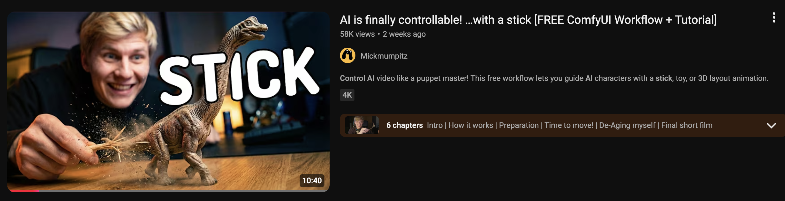

### TRELLIS.2

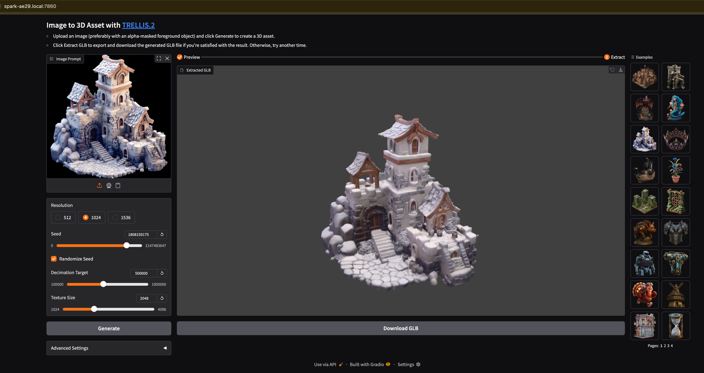

### Hunyuan-3D 

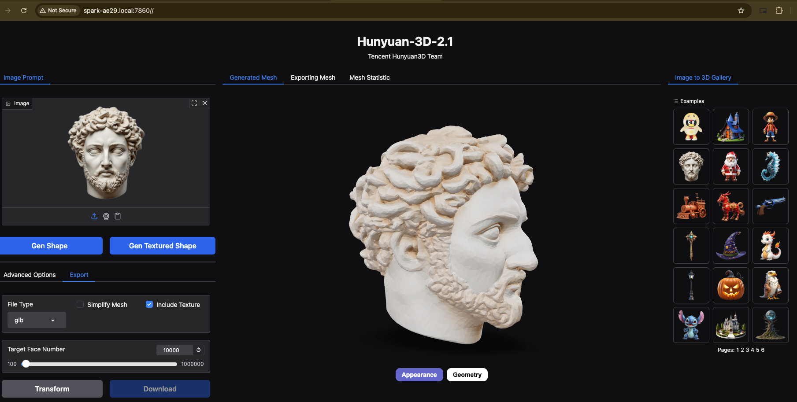

### F5-Spanish

[](https://www.youtube.com/shorts/0Xjd9KfmkA0)

### Deepseek OCR-2

[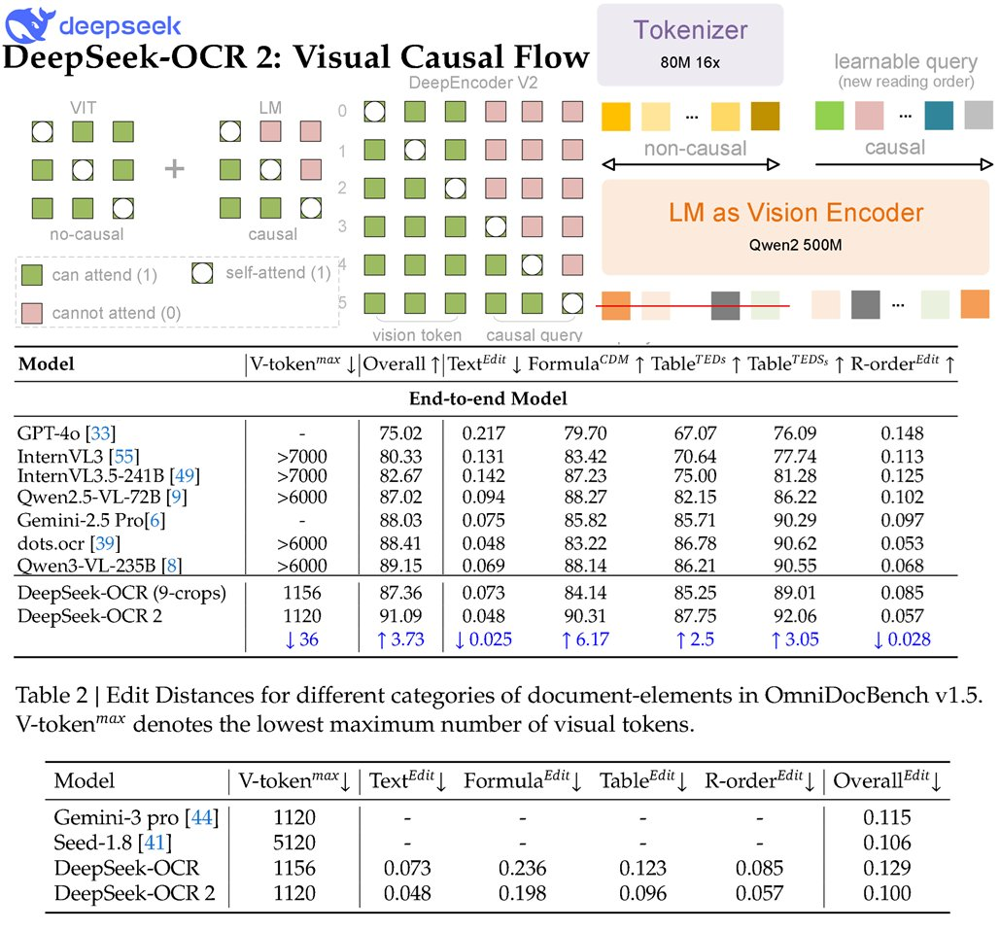](https://github.com/deepseek-ai/DeepSeek-OCR-2)

### Moss video and audio

[](https://mosi.cn/models/mova)

### Qwen3-ASR

[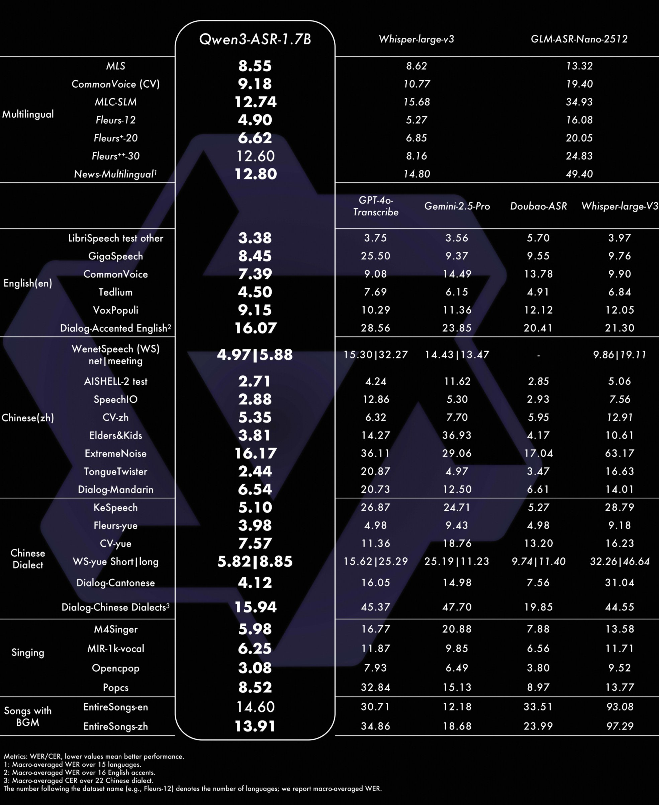](https://github.com/QwenLM/Qwen3-ASR)

### Qwen3-TTS

[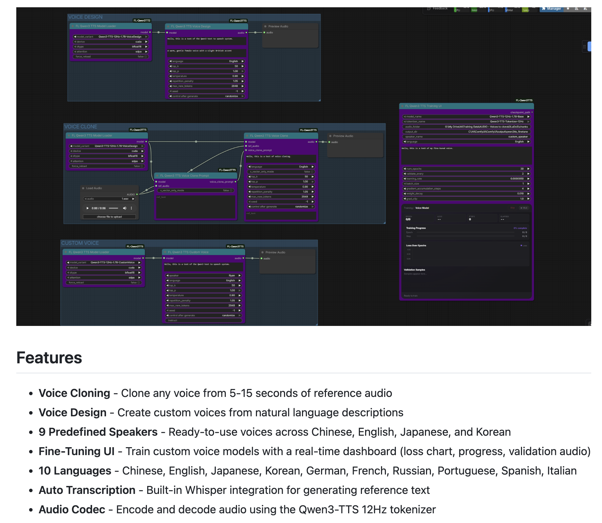](https://github.com/filliptm/ComfyUI-FL-Qwen3TTS)

### GLM 4.7 Flash

[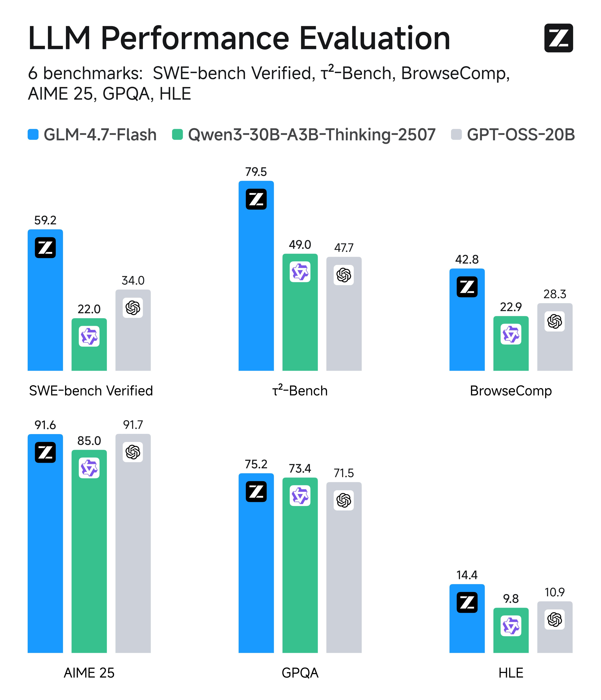](https://huggingface.co/zai-org/GLM-4.7-Flash)

### Home Assistant + Ollama

Docs de homeassitant: https://www.home-assistant.io/integrations/ollama/

### ACE-step 1.5

[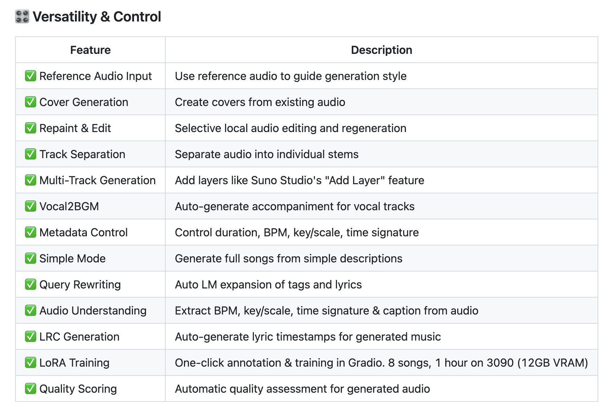](https://github.com/ace-step/ACE-Step-1.5)

### LTX-2

[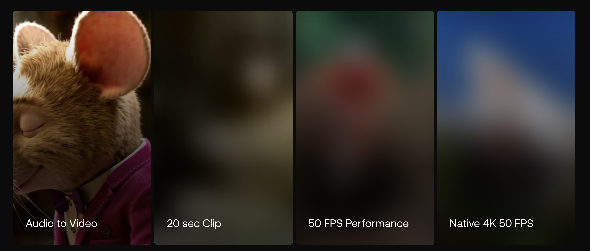](https://ltx.io/model/ltx-2)

## Proyectos de la comunidad

- [DGX Spark / GB10 Projects](https://forums.developer.nvidia.com/c/accelerated-computing/dgx-spark-gb10/dgx-spark-gb10-projects/723)

## Fuentes de información

- https://x.com/i/lists/2007522060344361209
